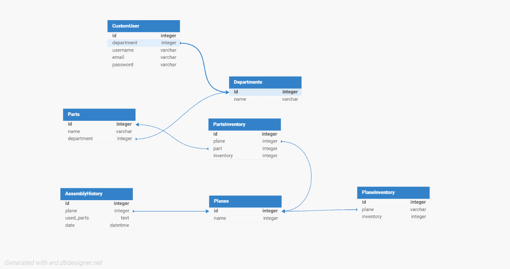

# Manufacturing Control App

The Manufacturing Control App is designed to streamline the production processes in a factory setting, focusing on part management, team responsibilities, and aircraft assembly. This project includes both frontend and backend components

Detailed Swagger Documentation Available
   ```bash
http://localhost:8000/swagger/
   ```

## Getting Started

To get started with the Manufacturing Control App, follow these steps:

1. Clone the repository:
   ```bash
   git clone https://github.com/semihcevik/manufacturing-control-app.git
   ```
2. Navigate to the project directory:
   ```bash
   cd manufacturing-control-app
   ```

## Running the Project with Docker

To build and run the project using Docker:

1. Build the Docker containers:
   ```bash
   docker-compose build
   ```
2. Start the containers:
   ```bash
   docker-compose up
   ```

The application will be accessible at `http://localhost:3000`

## Required Python
- Python 3.9.12 
